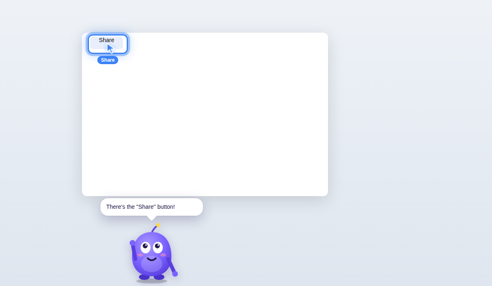

# Project Stark

Two agents share one glowing orb in the corner of your Mac screen:

- **Friday** (cool blue) learns a task by watching someone who knows it, then teaches it
  to anyone else, pointing at each button as they go.
- **Jarvis** (Iron Man gold, with an arc-reactor ring) just *does* a task Friday has learned,
  for you. He asks only for what's specific to this case, checks with you before anything
  risky, and can open your files. He sounds like the butler from Iron Man.

The orb's colour, voice and name tag always show who you're talking to.

A small glowing ball of energy that sits in the bottom-right corner of your Mac screen.
It breathes, swirls, and leans its light toward your mouse. Ask it to find a button and a
droplet of it squeezes out, flies across the screen, and turns into a cursor pointing at
the button, while it tells you where it is in an ElevenLabs voice. Then it flies home and
melts back in.

Ask it *how* to do something ("how do I make a new folder?") and it walks you through it
step by step with Claude, hopping to the next button each time you click.

Inspired by [Clicky](https://github.com/farzaa/clicky). Claude sees a screenshot of your screen
every turn, alongside the real buttons macOS Accessibility describes (exact positions).
Finding a button by its exact name still needs no AI at all.



## Run it (macOS)

You'll need [Node.js](https://nodejs.org) 20 or newer.

```bash
git clone <this repo> project-stark
cd project-stark
npm install
cp .env.example .env   # then paste your ElevenLabs key into .env (optional)
npm start
```

The first time it runs, macOS asks for two permissions. Grant both, then quit and restart
the app:

1. **Accessibility** (System Settings → Privacy & Security → Accessibility). This is what
   lets it read button names and positions. In dev mode the permission goes to your
   **terminal app** (Terminal, iTerm, VS Code), because that's what launched Electron.
2. **Automation → System Events.** Click *OK* on the popup the first time you ask
   for something.

## Using it

- **Click the buddy** or press **⌘⇧Space**, type what you're looking for, and press Enter.
  - `share`, `where's the save button`, `settings tab`, `the file menu`, `search box`
  - Typos are fine: `sned` → *Send*
  - Ask "how do I…" for something you've **taught it** and it walks you through it with the
    expert's steps, reasons and guardrails, moving on as you click. It only guides through
    skills it has learned; for anything else it says it hasn't learned that yet.
- **Say "Hey Friday"** instead of pressing anything, or "Hey Friday, how do I…" in one go.
  The mic listens in the background for the wake word (speech is sent to ElevenLabs to
  check), so it's on by default only when `ELEVENLABS_API_KEY` is set. Toggle it from the 👀
  menu, or set `WAKE_WORD` / `WAKE_WORD_ENABLED` in `.env`.

### Jarvis: have it done for you

Say **"Hey Jarvis"** (or type `Jarvis, …` in the prompt, or pick *Jarvis* in the 👀 menu) and
the orb turns gold. "Hey Friday" switches back.

- **Do a learned task:** "Jarvis, code this invoice." He matches it to a skill Friday has
  learned, asks for anything that changes from case to case ("Which cost center, sir? The rule
  is equipment over five thousand euros goes to 0400."), tells you what he's about to do, and
  waits for your **yes**. Then he does it: the orb's cursor flies to each button just before he
  clicks it, so you can see exactly what he's doing. Or open the **Skills Hub** and press
  **Have Jarvis do it**.
- **Find and open any file:** "open the Q3 budget spreadsheet", "the PDF I downloaded yesterday",
  "my latest screenshot", "the budget on my desktop in Numbers", "open my downloads". He searches
  names first, then contents, then (with Claude) other names it might have ("tax return" →
  "1040"), and ranks by how well it matches and how recently you used it. If a few are equally
  likely he asks which, and remembers your pick next time. "Where's my passport scan?" shows it in
  Finder instead.
- **Switch between windows:** "switch to the budget spreadsheet", "go back to YouTube", "find the
  window I had the meeting open in". He looks through every open window (minimised ones too) and
  Safari / Chrome / Brave / Edge / Arc tabs, and brings the right one to the front. Descriptions
  rather than names go to Claude. Asking to open something that's already open just switches to it.
- **Press a button:** "Jarvis, click Share."
- **The basics need no lesson:** "go to youtube.com", "search for flights to Rome", "type hello
  everyone", "press command S".
- **Anything else, he has a go.** He says what he'll try and gets on with it, working it out from
  what's on screen one action at a time. Harmless steps need no "shall I?"; risky clicks and keys
  still need your yes. He uses direct routes where they exist (opening files, apps and sites,
  switching windows, reading a file's text) rather than clicking through menus. If he isn't
  confident he can do it properly (a company-specific process, a judgment call, or it isn't
  working), he stops, at the start or halfway through, and says it needs teaching.
- **He never types or presses keys in a terminal.** For "get PianoScribe running" he reads the
  README and tells you the commands to run yourself.
- **Answer by voice or by typing.** When Jarvis or Friday asks you something, just answer out
  loud, or click the answer box, type, and press **Enter** (Esc gives the keyboard back).
- **Changed your mind?** "Wait, stop, I meant…" stops him and does what you said instead.
- Misheard names ("Piano Scrap") are corrected against your project folders, apps and skills.
- "How do I…" questions go to Friday, since that's learning rather than doing.

**Safety.** Jarvis is careful by design:

- He only does skills he was taught. He never improvises a procedure.
- Nothing happens until you say yes to his summary. A skip, silence or "hmm" counts as no.
- Anything hard to undo or that reaches other people (send, delete, pay, submit, publish,
  approve, quit…), and any step where the expert said "stop and ask", needs its own yes,
  every time.
- He never types passwords, card numbers or codes. He asks you to fill those in yourself.
- If he can't find something, he asks you to click it rather than guessing. If a field doesn't
  show what he typed, he asks before carrying on.
- **Stop him at any moment:** press **Esc**, say "stop", click the orb, press **Stop** in his
  bubble, or just click somewhere yourself.
- He only opens files in your home folder and apps from your Applications folders. He won't
  open anything that runs code (scripts, installers, `.command` files, apps in Downloads) or
  anything in hidden folders or `~/Library`.
- Every run is logged next to the skill in `runs/` (what he asked, what he clicked, how it ended).

Jarvis needs `ANTHROPIC_API_KEY` for tasks (opening files and pressing buttons don't). The
first time he clicks or types, macOS may ask again for Accessibility and Automation → System
Events for your terminal app.

### Lessons are a conversation

When Friday teaches a skill, the lesson plan is her structure, but she teaches like a person
sitting next to you rather than a click-through tutorial:

- **She sees what you do.** She gets a screenshot of the front window each time she's asked,
  plus Accessibility (buttons, fields, values, which window, where you're typing), and pairs your clicks and keys with
  what's under them, so she knows "you clicked Preferences" or "you typed Q3 into Search".
- **On track, she keeps up instantly.** Do the step and she's onto the next one, no waiting.
- **Off track, she helps.** "That opened Preferences. Close it, then click Export." Got there
  another way? She accepts it and carries on.
- **Your choices count.** Say you'd rather not use a mode she suggested, and she drops the steps
  that only apply to it instead of describing things you can't see.
- **Talk to her.** No "Hey Friday" needed during a lesson: ask "why are we doing this?", "how long
  will this take?", or "I'm not sure how" (she'll point exactly where), or type it in the box under
  the step. She answers, then brings you back to the goal.
- **She notices if you've gone quiet** and checks in once ("Still with me?"), without nagging.

### "This" means what's on your screen

Vague questions are taken to be about what's in front of you: the front window, the file it has
open, any text you've selected, or the field you're in.

- **Ask about it:** "what does this do?", "what's this error mean?", "summarize this", "which one
  should I pick?". Friday or Jarvis answers from what's on screen and points at what they're
  talking about.
- **"This" file:** "Jarvis, open this in Preview", "where's this saved?", "show this in Finder".
- **Vague requests pick the skill that fits where you are**, so "how do I export this?" in one app
  goes to the skill for that app.

### Seeing the screen

Every time Claude is asked something (a question, a lesson turn, a best-effort step, Jarvis
doing something), it gets **a screenshot of the screen the front window is on**, a note of which window
is where, plus Accessibility's list of controls. So "the other window", "the one on the left"
or "compare these two" work, not just the window in front. The screenshot is what it goes by, so diagrams, photos, canvases and apps that describe
nothing are all fair game; the list gives exact positions for the controls it does describe.

- **Pointing** works at anything visible: a list control exactly, otherwise a box on the screenshot.
- **Clicking** only ever goes to a control Accessibility confirms at that spot. If Jarvis sees
  something but nothing is confirmed there, he points at it and asks you to click.
- The orb is kept out of screenshots (content protection). `SCREEN_AREA=window` captures only
  the front window instead (more private, but blind to the others). The terminal and session log note every look.
- Saying an exact button name ("where's Export") still points instantly, with no screenshot, and
  following a taught lesson step by step still runs on Accessibility (no AI while you're on track).

It needs **Screen Recording** permission; without it they say so and go by Accessibility alone.
Each look adds a second or two and a little cost. `SCREEN_MODE=smart` goes back to looking only
when Accessibility isn't enough; `VISION_ENABLED=0` (or the 👀 menu) turns screenshots off.

### In the notch

With `ORB_PLACE=auto` in `.env`, on a MacBook with a notch the orb lives in it: a black island grows just out of the notch with
the orb peeking out on its right. When Friday or Jarvis is awake the island widens and says what
they're doing (Listening, Thinking, Speaking), and speech drops down underneath. Pointing still
flies out from there. Screens without a notch keep the bottom-right corner. `ORB_PLACE=notch`
puts it at the top centre on every screen. The default, `ORB_PLACE=corner`, keeps the corner.

### Calm by design

- **Resting is still.** While it only listens for its name, the orb doesn't swirl or follow the
  mouse. Motion means something is happening.
- **It knows when you're not talking to it.** Speech in a language you don't use with it
  (`SPEECH_LANGUAGES`) is ignored, and "thanks", "bye" or "well done" ends the conversation
  instead of being taken as a request. A follow-up without its name works for about 12 seconds.
- **Nothing is sent without a yes.** Pressing Return in a message or form field counts as
  sending, so Jarvis shows exactly what will go ("Ready to send "See you at 6" from "Message".
  Send it?") first. Search and address bars are exempt.
- **Pointing saves the fun for when it counts.** The first time it points in a conversation, a
  spark squeezes out of the orb and lands as a ring around the thing; after that the ring glides
  from target to target. Jarvis always uses the ring (never a cursor that looks like yours), and
  Friday's lessons keep the hopping spark cursor. `POINTER_STYLE=highlight` is always the ring,
  `POINTER_STYLE=spark` always the cursor.
- **Jarvis shows his work.** While he does a task, a small panel by the orb shows the task, the
  current step, a progress bar and Stop.
- Cards follow the Mac's light or dark appearance.

### Awake or dormant

The orb shows whether it's listening to you. **Dormant**: dimmer and calm, only listening for
"Hey Friday" / "Hey Jarvis". **Awake** (during a lesson, a task, a question, or for 20 seconds
after you've talked to it): a halo breathes around it and a small label under it says
**Listening**, **Hearing you**, **Thinking…**, **Speaking** or **Working…**. While it's awake,
just talk; no wake word needed.

### Things nobody has taught yet

Ask Friday how to do something she hasn't learned ("how do I turn on dark mode?", "open my
downloads") and she doesn't just say no: "I haven't been taught this, but let's give it a go."
She points at each step using general knowledge of macOS and common apps, and moves on when you
click, type, or the screen changes. If she isn't sure about a part, she says so honestly and
offers to learn it: say **"let me show you"** and she starts a lesson for exactly that task.

### Teach it a task (the apprentice)

Type `teach: <what you're about to do>` in the prompt, or pick *Teach me a task…* from the
👀 menu, then just do the task. The buddy watches the front window (fields changing value,
screens changing, what you click) and takes a screenshot at each step. When you pause, it may
ask one short question about a judgment call. Type your answer, or **Skip**. **Off the record**
pauses watching.

**Talk to it.** While it's learning, the mic is always on (needs `ELEVENLABS_API_KEY`):
explain what you're doing as you go and it becomes part of the lesson. Answer its questions out
loud; it sends your answer after a short pause, so take your time. Start talking while it's
speaking and it stops to listen. Say "off the record", "back on the record" or "I'm done".

Press **Finish** (or type `done`). It asks up to three debrief questions, explains the process
back to you, applies your corrections, then **tidies it up** so anyone can follow it from
wherever they start: it drops where you happened to begin (if you were on Facebook and typed the
real site's address, the lesson just says "open canva.com"), detours and stray clicks, lists
what the task assumes ("Signed in to Canva") under *Before you start*, and fills obvious gaps
(marked as added). It never invents reasons or rules. This happens once per skill: the tidied
lesson is saved and never re-done. Skills taught before this are tidied once in the background
when the app starts (the original is kept as `workmap.original.json`). Then it opens the
**Work Map**: a step-by-step tutorial with
the screen moment, the decision, your reason in your own words and the guardrails for each
step. Everything it has learned is in the **Skills Hub** (👀 menu → *Open Skills Hub*):
browse, search, open or delete skills, or teach a new one.

Needs `ANTHROPIC_API_KEY`. The first session asks for microphone access. For screenshots, allow **Screen Recording** for your terminal app
(System Settings → Privacy & Security), then restart it.
- The **👀** in the menu bar has *Ask*, a shortcut to the Accessibility settings, the folder
  for your `.env`, and *Quit*.

It searches every app window you can see on screen, including web pages in Safari, Chrome
and other Chromium browsers, plus the frontmost app's menu bar. Anything hidden behind
another window is skipped, and when two matches are equally good the one nearer the front wins.

### Start a software project

"Jarvis, get PianoScribe running": he reads the project's README, then runs its own start command
in a Terminal window you can see ("I'll run ./run.sh in Documents/pianoscribe. Go ahead, sir?"),
and opens the local address it prints. He only runs commands the project itself documents (its
README, package.json scripts or Makefile targets), each needs your yes, and anything that deletes,
needs sudo, runs a script from the internet or changes the system is refused.

### Try requests by typing (no voice, no mic)

Test what Jarvis does without speaking, and without spending ElevenLabs credits.
Everything he'd say is printed, and the microphone stays off:

```bash
npm run text
```

Type a request at the `>` prompt, or an answer when he asks something. You can also pass the
lines up front: it runs them in order and quits. `STARK_DRY=1` only logs clicks, typing and
opening things instead of doing them. It runs alongside the normal app.

```bash
STARK_DRY=1 npm run text -- "Jarvis, open the PianoScribe readme" "Jarvis, get PianoScribe running"
```

## API keys

All keys go in `.env`. See [`.env.example`](.env.example).

| Key | Needed? | What for |
| --- | --- | --- |
| `ELEVENLABS_API_KEY` | Optional | The buddy's voice. Without it, the built-in macOS voice is used. |
| `ELEVENLABS_VOICE_ID` | Optional | Which voice to use (defaults to "Jessica", warm and bright). |
| `ELEVENLABS_MODEL_ID` | Optional | Defaults to `eleven_v4_turbo` (expressive and real-time). |
| `ANTHROPIC_API_KEY` | Optional | Step-by-step walkthroughs with Claude (Opus 5.5). Without it, the buddy only finds buttons by name. |
| `OPENAI_API_KEY` | Not used yet | Reserved for anything else you want to add. |
| `VOICE_ENABLED` | Optional | `0` mutes the buddy. |
| `JARVIS_VOICE_ID` | Optional | Jarvis's ElevenLabs voice (defaults to "George", British). Without a key, the Mac's "Daniel" voice. |
| `JARVIS_WAKE_WORD` | Optional | Defaults to `jarvis`. |
| `JARVIS_ADDRESS` | Optional | How Jarvis addresses you: `sir` (default), `ma'am`, your name, or `none`. |

Keys are only used in the main process and are never sent to the page.
For the packaged app, put `.env` in `~/Library/Application Support/Project Stark/`
(menu bar 👀 → *Open folder for .env*).

## Build a .app

```bash
npm run dist   # → dist/Project Stark-0.1.0.dmg (unsigned)
```

Unsigned builds need right-click → Open the first time. After that, grant Accessibility to
**Project Stark** itself.

## How it works

```
⌘⇧Space / click ──▶ renderer (buddy UI) ──ask──▶ main.js
                                                   │
                                   src/finder.js ──┤ osascript -l JavaScript
                                                   │   src/jxa/list-elements.js
                                                   │   • on-screen windows via CGWindowList
                                                   │   • walk each app's AX tree (AXUIElement)
                                                   │   → [{role,label,app,z,x,y,w,h}, …]
                                   src/matcher.js ─┤ fuzzy match "where's share" → "Share"
                                   src/voice.js  ──┘ ElevenLabs TTS → mp3
                         ◀── rect + line to say ──
orb squeezes out a droplet → spark flies over → becomes the cursor, ring + voice
```

- `main.js` runs a transparent, click-through, always-on-top window over the screen. It
  only accepts clicks while your cursor is over the buddy or its bubble.
- `renderer/` draws the orb with CSS and Web Animations. A gooey SVG filter (blur plus an
  alpha threshold) makes the droplet stretch out of the orb and pinch off. The glow pulses
  with the voice.
- `src/matcher.js` is the fuzzy matcher. Run the tests with `npm test`.
- `src/teach.js` records a teaching session: it diffs a front-window scan every second into
  events, matches clicks (from a global input hook, `uiohook-napi`) to the element under the
  pointer, and decides when you've paused. `src/apprentice.js` asks Claude for questions and
  the Work Map; `src/workmap-page.js` renders the tutorial page.
- `src/jarvis.js` is Jarvis: Claude reads a learned skill once to work out which values to
  ask for and what to confirm (saved as `jarvis.json` next to it), then `JarvisRun` carries out
  the replay plan with the safety checks above. `src/act.js` (with `src/jxa/act.js`) does the
  clicking and typing; `src/files.js` finds and safely opens files; `src/persona.js` holds both
  agents' names, voices and phrases.
- `src/improvise.js` is the best-effort help for untaught tasks: Claude looks at the screen and
  gives one step at a time, or says honestly that it needs teaching.
- `src/guide.js` runs walkthroughs: each turn sends Claude your goal and a numbered list of
  on-screen elements, and gets back one step (what to say, which element to point at).
  `main.js` then watches a cheap screen fingerprint (windows, focus, open menu) to know
  when you've clicked.

## Known limits / ideas

- It doesn't search the Dock, or menu bars of apps that aren't in front.
- Some apps (games, some Java/Qt apps) don't expose accessibility info.
- A Chromium page's tree can be empty the first time. Ask again and it fills in.
- Next steps: push-to-talk voice input, using `ANTHROPIC_API_KEY` to understand vaguer
  requests ("how do I export this?"), and a screenshot + OCR fallback for apps without
  accessibility info.
